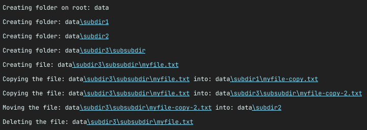
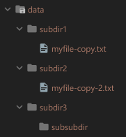

# Paths and Directories

In this exercise, we'll be reviewing the methods presented in the `Files` class.

Start your program in the `DirectoryManager` class. This class contains our `main` method.

For each of the steps, write a `System.out.println()` describing the action being taken. By the end
of the program's execution, you should have a clear view of what each step is doing.

##

## Step 1: Create a root folder

You want to create a folder called `data` on the root folder of our project. Start off by creating
a `Path` instance that points to the `data` path, and make a call to the `Files.createDirectory()`
method.

Run the code. Verify the `data` folder was created.

##

## Step 2: Add Safety to the folder's creation

Now, try to run the code again. You'll notice that you'll get an exception:

```shell
Exception in thread "main" java.nio.file.FileAlreadyExistsException: data
```

Go ahead and take care of that. Use either the `Files.exists()` or `Files.notExists()` and only
create the folder if it doesn't exist already.

##

## Step 3: Create subfolders

Now create 3 subfolders inside the `data` folder: `subdir1`, `subdir2` and `subdir3/subsubdir`. The
last one means that the `subdir3` subfolder should also contain a subfolder called `subsubdir`.

> **Hint:** You can use the `path.resolve()` method when you want to resolve a path out of an existing path:
> ```java
> Path subdir1 = root.resolve("subdir1");
> ```
> The `resolve()` method is overloaded and also accepts another `Path` as a parameter.

> **Hint:** Use the `Files.createDirectories()` method instead when you want to create a directory
> when the parent's folder(s) don't exist yet.

Make sure to also only create the folders when they don't exist, so you don't get an exception the
next time you run the program.

##

## Step 4: Create a file

What you want to do now is to create a file called `myfile.txt` inside `subdir3/subsubdir`. `Files`
has a method for creating files.

> **Hint:** Again, you could use the `resolve()` method here on the path of the third directory to
> directly create the path to the file.

##

## Step 5: Copy the file

Create a copy of the file `subdir3/subsubdir/myfile.txt` inside the `subdir1` folder. Name
it `myfile-copy.txt`.

Replace any existing copy to avoid errors. Achieve it by passing the
option `StandardCopyOption.REPLACE_EXISTING` while copying the file.

##

## Step 6: Move a file

Create another copy of the file `subdir3/subsubdir/myfile.txt`. This time inside the `subdir3`
folder itself. Name it `myfile-copy2.txt`.

After that, move the file to the `subdir2` folder. Also replace existing copies.

> **Hint:** the `path.getFileName()` returns a path containing the relative path to the file name
> only. This might be useful!

##

## Step 7: Delete the original file

Go ahead and delete the original `myfile.txt`.

##

## A Last Execution!

Once all the steps are done, go ahead and delete the `data` folder entirely. Execute the program one
last time, and make sure you have an output similar to the following:



And your folder/file structure should be:


